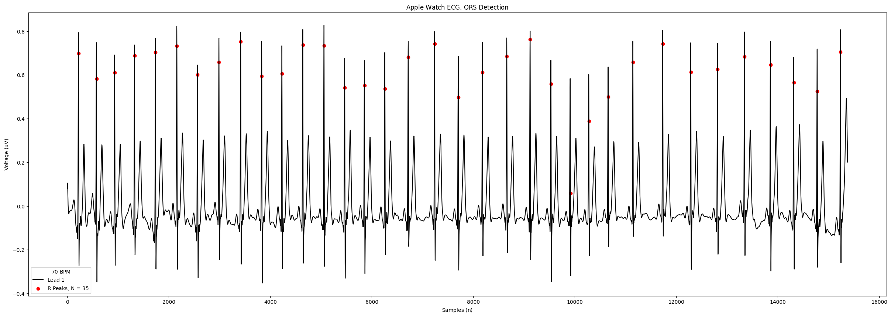
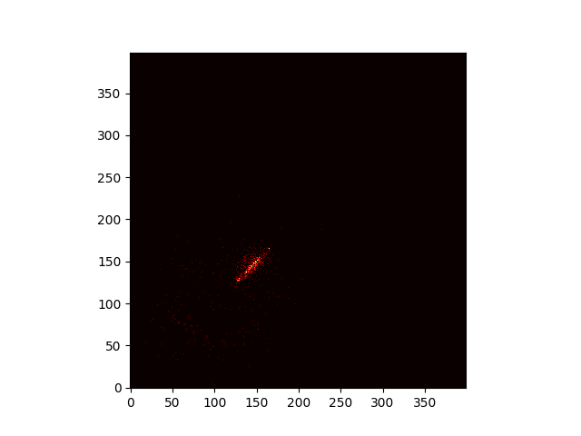
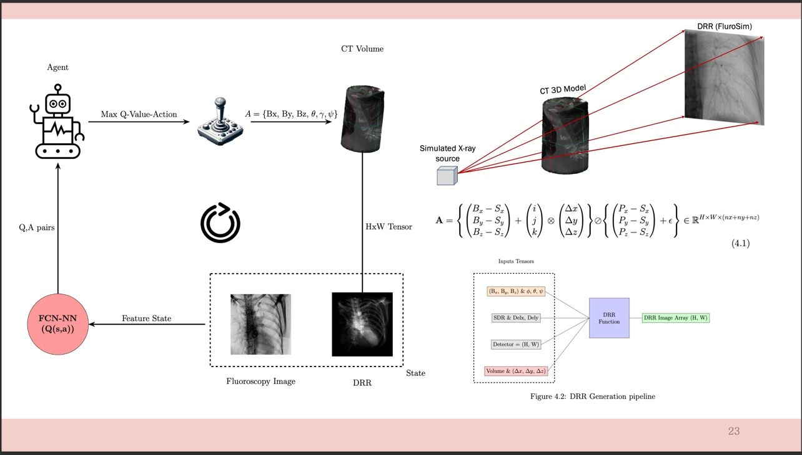
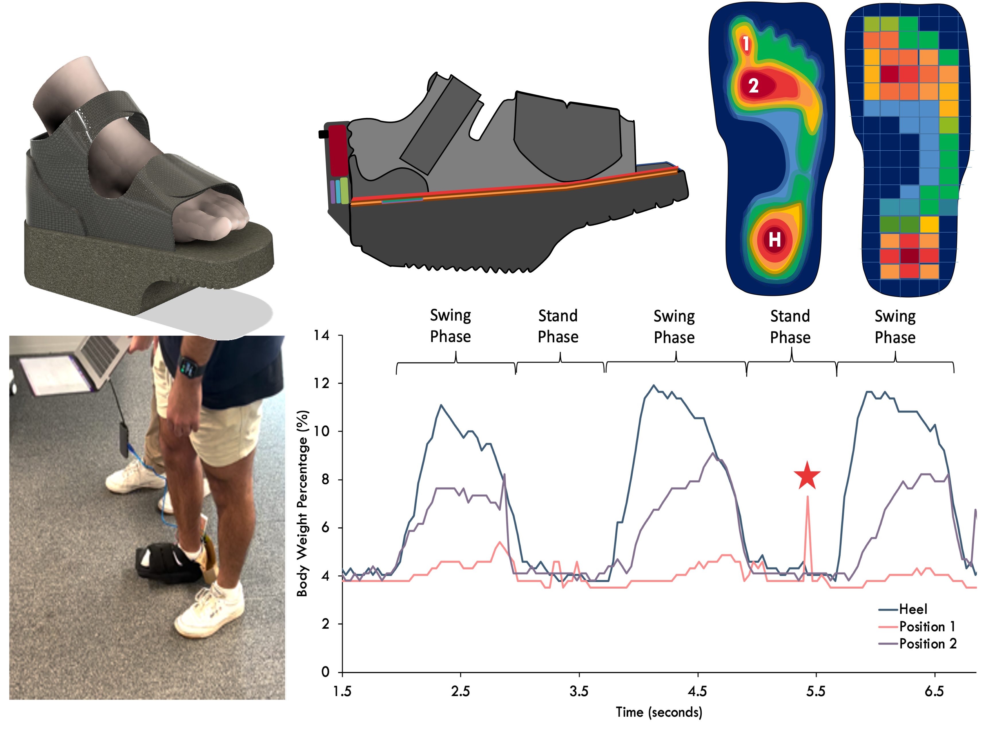

# Design Portfolio
## Table of Contents
- ### [Professional Experience](Professional.md)
- ### [Research Experience](research.md)
- ### [Open Source Projects](opensource.md)
- ### [Tutorials](Tutorials.md)

## Projects
### [Dynamic-ECG](opensource.md#dynamic-ecg/Dynamic-ECG) : Algorithms for ECG Signal Analysis 
    

My Python-based library for ECG analysis, including R,P,T wave detection, Poincare analysis, wavelets-based analysis and several Visualisation features! Portability with both short ECG & Long Form Holter data. Formats such as NumPy, EDF, H5 and even Apple Watch ECG data (CSV export).

### [CatchAF](opensource.md#CatchAF/CatchAF): Multi-Modal Atrial Fibrillation Detection Model

    

An AF detection model that uses Dynamic-ECG for Poincare-Plot generation as the data input for a Computer Vision model. Trained on the [IRIDIA-AF](https://www.nature.com/articles/s41597-023-02621-1) dataset, the model achieved a 98% accuracy in detecting AF from ECG data. The model is available for download and use in the CatchAF repository.

### Deep Reinforcement Learning for Cardiac CT-Fluoroscopy Registration

    

Implemented a deep reinforcement learning model using PyTorch and deep Q network to register 6DOF cardiac CT images with fluoroscopy images. Achieved a 90% success rate in image registration, improving the accuracy of cardiac procedures. Collaborated with CHU de Bordeaux, France, and the UWA Medical Imaging Physics Group, using CARTO EP files.

### Real-time Arrhythmia Sagemaker Detection System
    

Developed a real-time arrhythmia detection system using AWS Sagemaker and Lambda. The system uses a deep learning model trained on the MIT-BIH dataset to detect arrhythmias in ECG data. The model is deployed on AWS Sagemaker and invoked using AWS Lambda functions. The system achieved an accuracy of 98% in detecting arrhythmias in real-time ECG data.

### Assistive Smart Orthopedic Sensor Device - SMART BOOT
  

Constructed Gait-Force frequency Algorithm Development using non-linear differential equation modeling, implemented with Python. Engaged in signal engineering & sensor design. Focused on high bandwidth data optimization. Developed a biosensor area monitoring system. CoLed the clinical prototype Development, including the regulatory & patent application process.

## Tutorials

### Train on MAC, upload to AWS Sagemaker - 10/2023
**AWS Sagemaker, Python, MacOS**

### BioSignals 

### R wave detection
**ECG, Python, NumPy**

### Phasor Transform

### Poincare plot

