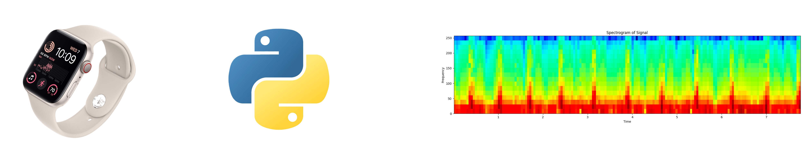

# Open Source Projects
These are my main open source projects that I have worked on. They are all available on GitHub.

## Dynamic-ECG

### Description
Dynamic ECG is an all in one repository for base ECG signal analysis, this includes R, P, T wave detection, Poincare analysis, wavelets-based analysis and several Visualisation features! Portability with both short ECG & Long Form Holter data. Formats such as NumPy, EDF, H5 and even Apple Watch ECG data (CSV export).

### Features
- R, P, T wave detection

- Poincare analysis

- Wavelets-based analysis

- Visualisation features

- Digital Stethoscope

## CatchAF