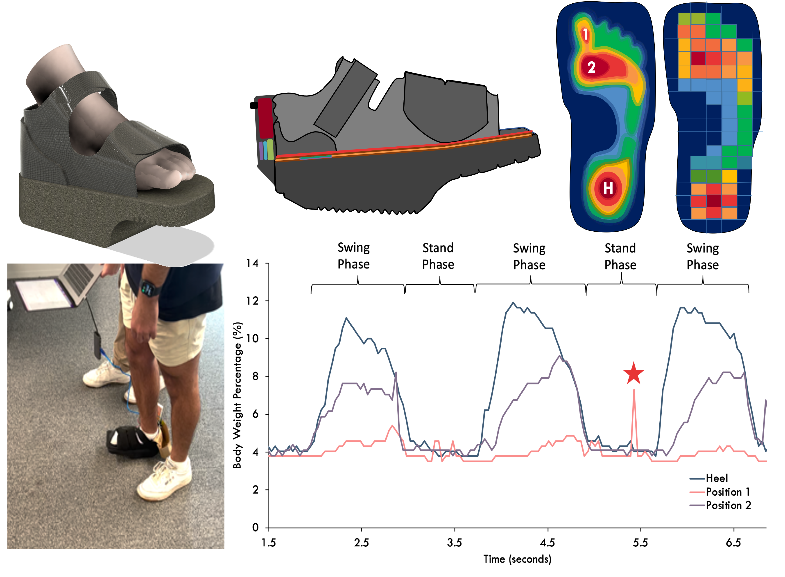

# Research & Education
### Deep Reinforcement Learning for Cardiac CT-Fluoroscopy Registration - 11/2023

**Engineering Master Thesis | University of Western Australia & [Liryc, de Bordeaux, France](https://www.ihu-liryc.fr/en/)**

- Developed a deep reinforcement learning model using PyTorch to register 6DOF cardiac CT images with fluoroscopy images.
- Registration of 3D CT images with 2D fluoroscopy images, using a custom-designed algorithm, implemented with Python and PyTorch.
- Acquired 90% success rate in registering images, improving the accuracy of cardiac procedures.
- Collaborated with CHU de Bordeaux, France, and the UWA Medical Imaging Physics Group, using CARTO EP files.

### Assistive Smart Orthopedic Sensor Device, (SMART BOOT) - 08/2022
**Medical Device Design Project with [BioDesign (UWA)](https://www.perthbiodesign.au)**

- Constructed Gait-Force frequency Algorithm Development using non-linear differential equation modeling, implemented with Python.
- Engaged in signal engineering & sensor design. Focused on high bandwidth data optimization. Developed a biosensor area monitoring system.
- CoLed the clinical prototype Development, including the regulatory & patent application process.
